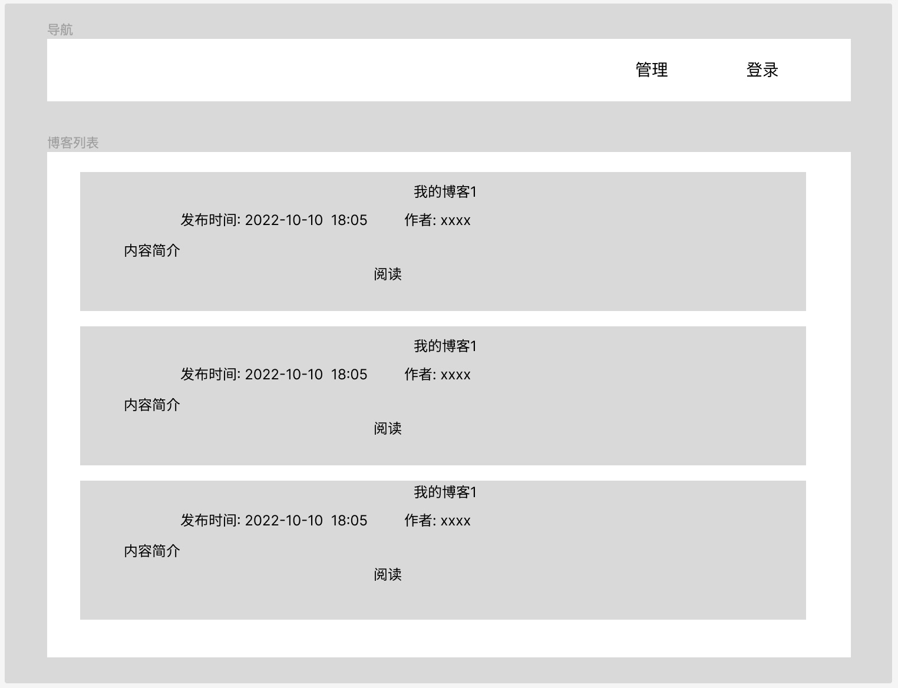
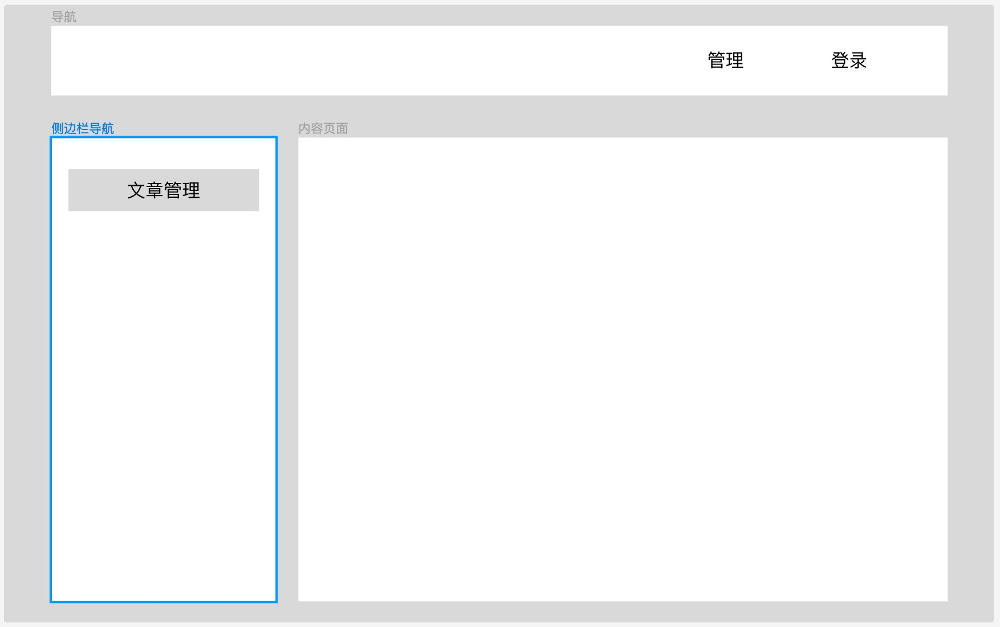

# vblog 前端部分

## 项目初始化

这里我们直接使用 vue cli 初始化我们的骨架, 然后在此基础上进行修改

```shell
npm create vue@latest

> npx
> create-vue


Vue.js - The Progressive JavaScript Framework

√ 请输入项目名称： ... ui
√ 是否使用 TypeScript 语法？ ... 否 / 是             # 否
√ 是否启用 JSX 支持？ ... 否 / 是                    # 否
√ 是否引入 Vue Router 进行单页面应用开发？ ... 否 / 是  # 是
√ 是否引入 Pinia 用于状态管理？ ... 否 / 是            # 是
√ 是否引入 Vitest 用于单元测试？ ... 否 / 是           # 否
√ 是否要引入一款端到端（End to End）测试工具？ » 不需要
√ 是否引入 ESLint 用于代码质量检测？ ... 否 / 是        # 是
√ 是否引入 Prettier 用于代码格式化？ ... 否 / 是        # 是
√ 是否引入 Vue DevTools 7 扩展用于调试? (试验阶段) ... 否 / 是  # 否

正在初始化项目 C:\Users\duyup\Documents\vblog\ui...

项目初始化完成，可执行以下命令：

  cd ui
  npm install
  npm run format
  npm run dev
```

设置项目源，我们需要安装依赖，`npm` 默认使用的是国外源，下载依赖可能会失败。使用 `nrm` 查看 `npm` 支持的源

```shell
nrm ls
  npm ---------- https://registry.npmjs.org/
  yarn --------- https://registry.yarnpkg.com/
  tencent ------ https://mirrors.cloud.tencent.com/npm/
  cnpm --------- https://r.cnpmjs.org/
* taobao ------- https://registry.npmmirror.com/
  npmMirror ---- https://skimdb.npmjs.com/registry/
```

通过 `nrm test` 测试所有源

```shell
nrm test
  npm ---------- timeout (Fetch timeout over 5000 ms)
  yarn --------- 2304 ms
  tencent ------ 937 ms
  cnpm --------- 1808 ms
* taobao ------- 56 ms
  npmMirror ---- timeout (Fetch timeout over 5000 ms)

```

通过 `nrm use` 设置最快的源

```shell
nrm use taobao
```

## 清理模版页面

在做 `Home` 页面之前，先清理掉脚手架为我们生成的页面，保留空白页面

删除不需要的组件：删除 `src/components` 中的所有组件，删除 `src/views` 中的 `AboutView.vue`

清理 `App.vue` 和 `HomeView.vue` 中不需要的内容

`App.vue` 中保留的内容

```html
<script setup></script>

<template>
  <div>App</div>
</template>

<style scoped></style>
```

`HomeView.vue` 中保留的内容

```html
<script setup></script>

<template>
  <div>Home</div>
</template>
```

## 清理样式

删除 `src/assets/base.css` 和 `src/assets/main.css` 中的所有内容

添加 [`normalize.css`](https://necolas.github.io/normalize.css/)

设置 `base.css`

```css
* {
  box-sizing: border-box;
}

html,
body {
  width: 100%;
  height: 100%;
  margin: 0;
  padding: 0;
  font-size: 14px;
  background-color: var(--color-bg-1);
  -moz-osx-font-smoothing: grayscale;
  -webkit-font-smoothing: antialiased;
}

#app {
  width: 100%;
  height: 100%;
}
```

在 `main.css` 中导入

```css
@import 'normalize.css'; /* 导入 normalize.css */
@import 'base.css'; /*导入 base.css*/
```

## UI组件

安装 [arco design](https://arco.design/) UI 组件

```shell
 npm install --save-dev @arco-design/web-vue
```

在 [main.js](src/main.js) 中引入 UI 组件

```js
import { createApp } from 'vue'
import App from './App.vue'

// 加载组件
import ArcoVue from '@arco-design/web-vue'
// 引入 UI 组件的样式
import '@arco-design/web-vue/dist/arco.css'

const app = createApp(App)

// 使用 UI 组件：这里会见所有的 UI 组件注册到 Vue 的全局组件列表中
app.use(ArcoVue)
app.use(createPinia())
app.use(router)

app.mount('#app')
```

### 测试

我们在 `App.vue` 中引入下面的页面进行测试

```html
<script setup></script>

<template>
  <div>
    <a-space>
      <a-button type="primary">Primary</a-button>
      <a-button>Secondary</a-button>
      <a-button type="dashed">Dashed</a-button>
      <a-button type="outline">Outline</a-button>
      <a-button type="text">Text</a-button>
    </a-space>
  </div>
</template>

<style scoped></style>
```

只要能显示 $5$ 个按钮就证明 UI 组件引入成功

### Icon 组件

**Arco 图标是一个独立的库**，需要额外引入并注册使用

```js
import './assets/main.css'

import { createApp } from 'vue'
import { createPinia } from 'pinia'

import App from './App.vue'
import router from './router'

// 加载组件
import ArcoVue from '@arco-design/web-vue';
// 额外引入图标库
import ArcoVueIcon from '@arco-design/web-vue/es/icon';
// 引入 UI 组件的样式
import '@arco-design/web-vue/dist/arco.css';


const app = createApp(App)

app.use(createPinia())
app.use(router)
app.use(ArcoVue)  // 注册 Arco UI 组件
app.use(ArcoVueIcon) // 注册 Arco Icon 组件

app.mount('#app')
```

## 异常页面

这里我们需要补充 $2$ 种 [异常页面](src/views/README.md)

## 路由

为了切换和展示页面，需要引入 [路由](./src/router/README.md)

## 布局

vblog 界面分为 **前台** 和管理 **后台**

博客前台样式如下



博客管理后台:



布局需要 [嵌套路由](./src/router/README.md#嵌套路由) 的支持

无论前台还是后台，都需要一个 **导航栏** 。因此，我们在 `App.vue` 中布局导航栏

```html
<script setup>
    import {RouterView} from "vue-router"
</script>

<template>
    <div class="main-container">
        <!-- 导航区 -->
        <div class="navigation">

            <!-- Logo 显示区域 -->
            <div class="">
                杜宇鹏的个人博客系统
            </div>
            <!--登录操作区域-->
            <div>
                <a-space>
                    <a-button>管理(登录后出现)</a-button>
                    <a-button>登录(未登录出现)</a-button>
                </a-space>
            </div>
        </div>
        <!-- 页面展示区 -->
        <div class="main-page">
            <!-- 路由出口：路由匹配到的组件将在这里渲染 -->
            <RouterView></RouterView>
        </div>
        <!-- 页脚 -->
        <div class="main-footer">
        </div>
    </div>
</template>

<style scoped>

    .main-container {
        width: 90vw;
        height: 90vh;
        margin: 0 auto;
    }

    .navigation {
        /*样式*/
        height: 45px;
        border-bottom: solid 2px #ccc;
        background-color: #F2F3F5;

        /* 布局 */
        display: flex;
        justify-content: space-between;
        align-items: center;
    }

    .main-page {
        height: 100%;
        width: 100%;
        border-left: solid 2px #ccc;
        border-right: solid 2px #ccc;
    }

    .main-footer {
        border: solid 2px #ccc;
    }
</style>
```

### 前台

因为前台与后台布局样式不一样, 因此分别使用独立布局模版.

前台布局模版: `FrontendLayout.vue`

### 后台

博客后台使用的布局模版: `BackendLayout.vue`

这里我们需要使用到侧边栏导航: [Arco Design菜单 Menu](https://arco.design/vue/component/menu)


## 致谢

- [normalize.css](https://necolas.github.io/normalize.css/)
- [vue](https://cn.vuejs.org/)

- [arco design](https://arco.design/)
- [ant design](https://ant-design.antgroup.com/index-cn)
- [element plus](https://element-plus.org/zh-CN/)
- [TDesign](https://tdesign.tencent.com/)
