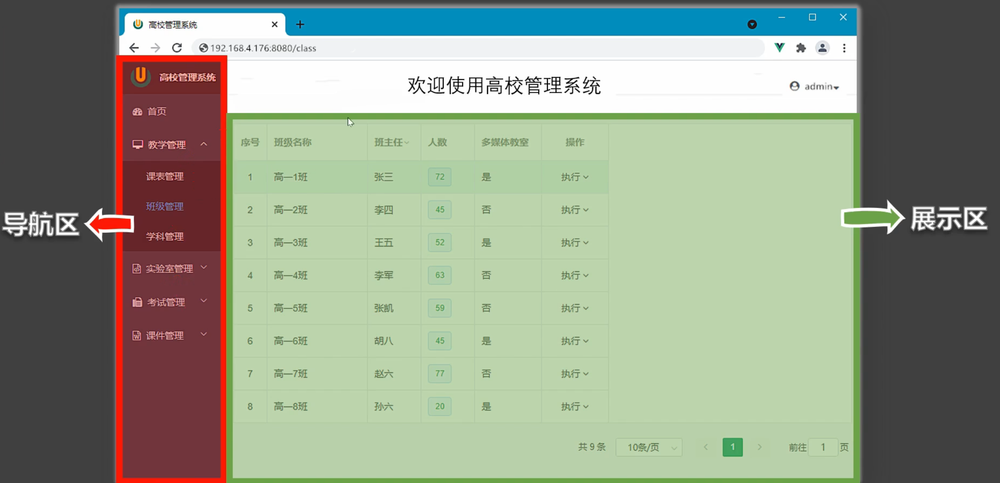
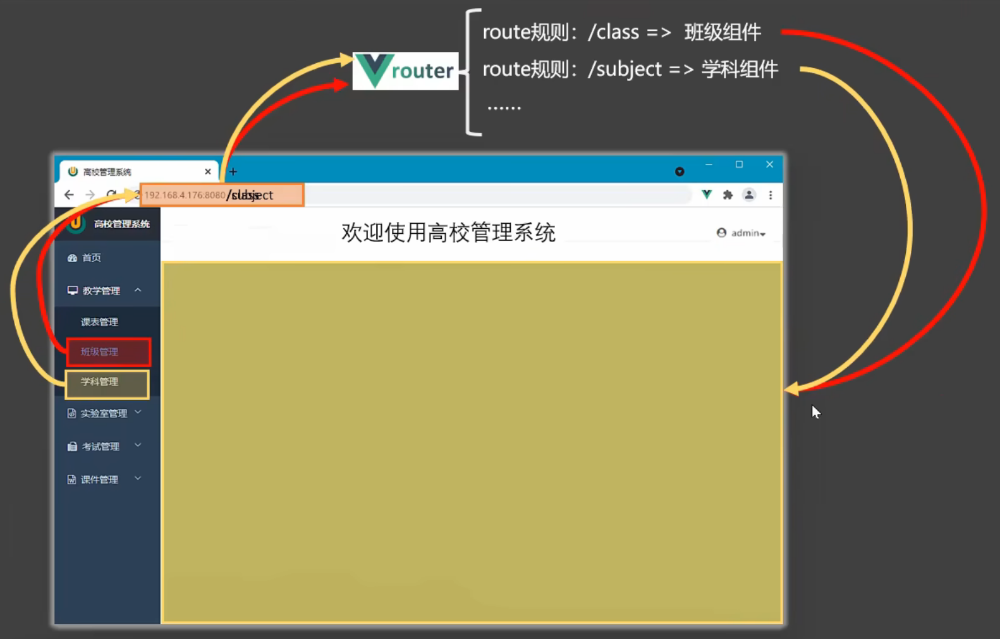

# 路由

客户端 **路由** 的作用是在 **单页应用 (SPA)** 中将浏览器的 **URL** 和用户看到的 **视图** 绑定起来

具体的来讲，客户端 **路由** 就是 **一个 `parttern(模式)` 和 一个 `view` 的绑定关系**。管理这些绑定关系的称为 **路由器**

**单页应用**：至始至终都只有一个 `.html` 页面。其他页面通过视图切换展示 

## 路由的工作流程

当点击导航区中的某一项时，会 **引起浏览器 URL 的变化**，这个变化会 **被 Vue Router 监测** 到，Router 就会进行路由匹配，路由匹配成功之后,首先 **卸载展示区中的页面**，然后 **重新挂载匹配成功的视图组件**



Vue 中视图之间的切换最主要的就是 **引起浏览器 URL 的变化**，只要 URL 发生变化，就会 **被 Vue Router 检测到**，从而 **触发视图的切换**


要在 Vue 中使用路由完成单页应用，就需要编写 **视图组件**，然后创建路由器(提供 **路由表**)，最后 **在主页面上展示**

> 路由表: `(模式, 视图组件)` 形成键值对
> 
> 页面切换的时，视觉上消失的视图组件，默认是被 **卸载** 的，当需要时再重写挂载

## 注册路由

我们已经完成 [异常视图组件](../views/README.md#异常视图) 的编写了。现在，将它们注册到路由表中

首先，创建路由器，并提供路由表，然后默认导出路由器。这部内容，在 `router/index.js` 中编写
```js
// 导入创建路由和路由历史记录模式函数
import { createRouter, createWebHistory } from 'vue-router'
import HomeView from '../views/HomeView.vue'

// 创还能一个 router
const router = createRouter({
  history: createWebHistory(import.meta.env.BASE_URL),
  routes: [
    {
      path: '/',
      name: 'home',
      component: HomeView
    },
    {
      path: '/error/403',
      name: 'PermissionDeny',
      // route level code-splitting
      // this generates a separate chunk (About.[hash].js) for this route
      // which is lazy-loaded when the route is visited.
      component: () => import('../views/errors/PermissionDeny.vue')
    },
    {
      path: "/:pathMatch(.*)*",  // 匹配所有前面没有命中的路由
      name: "NotFound",
      component: () => import('../views/errors/NotFound.vue'),
    }
  ]
})

// 将 router 暴露出去
export default router
```

然后在 [main.js](../main.js) 中导入 `router`，并加载在 `Vue app` 中

```js
import './assets/main.css'

import { createApp } from 'vue'

import App from './App.vue'
import router from './router'

const app = createApp(App)

app.use(router)  // 加载 router

app.mount('#app')
```

> 稍后介绍 **历史记录模式** 

然后，在 [`App.vue`](../App.vue) 中编写路由展示区域

```html
<script setup>
import {RouterView} from "vue-router"
</script>

<template>
<!-- 这是根页面：所有的页面都需要挂载在 App.vue 中才能呈现出来 -->
<!--  特别是 Vue Router 的子页面 -->
  <div>
    
  <!-- 路由出口：路由匹配到的组件将在这里渲染 -->
    <RouterView/>
  </div>
</template>

<style scoped></style>
```

### 历史记录模式

在创建路由器实例时，`history` 配置允许我们在不同的历史模式中进行选择。

#### Hash 模式

hash 模式是用 `createWebHashHistory()` 创建的：

```js
import { createRouter, createWebHashHistory } from 'vue-router'

const router = createRouter({
  history: createWebHashHistory(),
  routes: [
    //...
  ],
})
```

它在内部传递的实际 URL 之前使用了一个哈希字符(`#`)。由于这部分 URL 从未被发送到服务器，所以它不需要在服务器层面上进行任何特殊处理。不过，它在 SEO 中确实有不好的影响。如果你担心这个问题，可以使用 HTML5 模式。

#### Memory 模式

Memory 模式不会假定自己处于浏览器环境，因此不会与 URL 交互也不会自动触发初始导航。这使得它非常适合 Node 环境和 SSR。它是用 `createMemoryHistory()` 创建的，并且需要你在调用 `app.use(router`) 之后手动 `push` 到初始导航。

```js
import { createRouter, createMemoryHistory } from 'vue-router'
const router = createRouter({
  history: createMemoryHistory(),
  routes: [
    //...
  ],
})
```

虽然不推荐，你仍可以在浏览器应用程序中使用此模式，但请注意它 **不会有历史记录**，这意味着你无法后退或前进。

#### HTML5 模式

用 `createWebHistory()` 创建 HTML5 模式，推荐使用这个模式：

```js
import { createRouter, createWebHistory } from 'vue-router'

const router = createRouter({
  history: createWebHistory(),
  routes: [
    //...
  ],
})
```

当使用这种历史模式时，URL 会看起来很 "正常"，例如 `https://example.com/user/id` 。漂亮!

不过，问题来了。由于我们的应用是一个单页的客户端应用，如果没有适当的服务器配置，用户在浏览器中直接访问 `https://example.com/user/id` ，就会得到一个 404 错误。这就尴尬了。

不用担心：要解决这个问题，你需要做的就是在你的服务器上添加一个简单的回退路由。如果 URL 不匹配任何静态资源，它应提供与你的应用程序中的 `index.html` 相同的页面。漂亮依旧!

## 路由切换(导航)

路由切换(**导航**)由两种方式：`RouterLink` 和 编程式导航

### RouterLink

最简单的导航方式就是使用 `Vue Router` 提供的 `RouterLink` 组件。该组件需要指定一个属性 `to="路径/对象""`

使用 **字符串路径** 的方式进行导航

```html
<RouterLink to="/"> Home</RouterLink>
<RouterLink to="/error/403"> PermissionDeny</RouterLink>
```

使用 **对象** 的方式进行导航：对象中必须要有 `path` 或 `name` 属性，这两个值是在 [Router](../router/index.js) 中注册时提供

```html
<RouterLink :to="{path:'/'}"> Home</RouterLink>
<RouterLink :to="{name:'PermissionDeny'}"> PermissionDeny</RouterLink>
```

### 编程式导航

除了使用 `<router-link>` 创建 `a` 标签来定义导航链接，我们还可以借助 `router` 的实例方法，通过编写代码来实现。

#### 导航到不同位置

注意: 下面的示例中的 `router` 指代路由器实例。如果使用组合式 API，你可以通过调用 `useRouter()` 来访问路由器

想要导航到不同的 `URL`，可以使用 `router.push` 方法。这个方法会向 `history` 栈添加一个新的记录，所以，当用户点击浏览器后退按钮时，会回到之前的 `URL`

当你点击 `<router-link>` 时，内部会调用这个方法，所以点击 `<router-link :to="...">` 相当于调用 `router.push(...)`

该方法的参数可以是一个 **字符串路径**，或者一个 **描述地址的对象**。例如

```js
// 字符串路径
router.push('/users/eduardo')

// 带有路径的对象
router.push({ path: '/users/eduardo' })

// 命名的路由，并加上参数，让路由建立 url
router.push({ name: 'user', params: { username: 'eduardo' } })

// 带查询参数，结果是 /register?plan=private
router.push({ path: '/register', query: { plan: 'private' } })

// 带 hash，结果是 /about#team
router.push({ path: '/about', hash: '#team' })
```

注意：如果提供了 `path`，`params` 会被忽略，上述例子中的 `query` 并不属于这种情况。

取而代之的是下面例子的做法，你需要提供路由的 `name` 或手写完整的带有参数的 `path`

```js
const username = 'eduardo'
// 我们可以手动建立 url，但我们必须自己处理编码
router.push(`/user/${username}`) // -> /user/eduardo
// 同样
router.push({ path: `/user/${username}` }) // -> /user/eduardo
// 如果可能的话，使用 `name` 和 `params` 从自动 URL 编码中获益
router.push({ name: 'user', params: { username } }) // -> /user/eduardo
// `params` 不能与 `path` 一起使用
router.push({ path: '/user', params: { username } }) // -> /user
```

#### 替换当前位置

它的作用类似于 `router.push`，唯一不同的是，它在导航时不会向 `history` 添加新记录，正如它的名字所暗示的那样——它取代了当前的条目。

```js
router.push({ path: '/home', replace: true })
// 相当于
router.replace({ path: '/home' })
```

#### 横跨历史

该方法采用一个整数作为参数，表示在历史堆栈中前进或后退多少步，类似于 `window.history.go(n)`。

```js
// 向前移动一条记录，与 router.forward() 相同
router.go(1)

// 返回一条记录，与 router.back() 相同
router.go(-1)

// 前进 3 条记录
router.go(3)

// 如果没有那么多记录，静默失败
router.go(-100)
router.go(100)
```

## 嵌套路由

一些应用程序的 UI 由多层嵌套的组件组成。在这种情况下，`URL` 的片段通常对应于特定的嵌套组件结构，例如：

```
/user/johnny/profile                   /user/johnny/posts 
┌──────────────────┐                  ┌──────────────────┐
│ User             │                  │ User             │
│ ┌──────────────┐ │                  │ ┌──────────────┐ │
│ │ Profile      │ │  ●────────────▶  │ │ Posts        │ │
│ │              │ │                  │ │              │ │
│ └──────────────┘ │                  │ └──────────────┘ │
└──────────────────┘                  └──────────────────┘
```

通过 Vue Router，你可以使用 **嵌套路由配置** 来表达这种关系。

```html
<!-- App.vue -->
<template>
  <router-view />
</template>
```

```html
<!-- User.vue -->
<template>
  <div>
    User {{ $route.params.id }}
  </div>
</template>
```

```js
import User from './User.vue'

// 这些都会传递给 `createRouter`
const routes = [{ path: '/user/:id', component: User }]
```
这里的 `<router-view>` 是一个顶层的 `router-view`。它渲染顶层路由匹配的组件。同样地，一个 **被渲染的组件也可以包含自己嵌套的 `<router-view>`**。例如，如果我们在 `User` 组件的模板内添加一个 `<router-view>`：

```html
<!-- User.vue -->
<template>
  <div class="user">
    <h2>User {{ $route.params.id }}</h2>
    <router-view />
  </div>
</template>
```

要将组件渲染到这个嵌套的 `router-view` 中，我们 **需要在路由中配置 `children`**：

```js
const routes = [
  {
    path: '/user/:id',
    component: User,
    children: [
      {
        // 当 /user/:id/profile 匹配成功
        // UserProfile 将被渲染到 User 的 <router-view> 内部
        path: 'profile',
        component: UserProfile,
      },
      {
        // 当 /user/:id/posts 匹配成功
        // UserPosts 将被渲染到 User 的 <router-view> 内部
        path: 'posts',
        component: UserPosts,
      },
    ],
  },
]
```

注意，以 `/` 开头的嵌套路径将被视为根路径。这允许你利用组件嵌套，而不必使用嵌套的 `URL`。

如你所见，**`children` 配置只是另一个路由数组**，就像 `routes` 本身一样。因此，你可以根据自己的需要，不断地嵌套视图。

此时，按照上面的配置，当你访问 `/user/eduardo` 时，在 `User` 的 `router-view` 里面什么都不会呈现，因为没有匹配到嵌套路由。也许你确实想在那里渲染一些东西。在这种情况下，你可以提供一个空的嵌套路径：

```js
const routes = [
  {
    path: '/user/:id',
    component: User,
    children: [
      // 当 /user/:id 匹配成功
      // UserHome 将被渲染到 User 的 <router-view> 内部
      { path: '', component: UserHome },

      // ...其他子路由
    ],
  },
]
```


