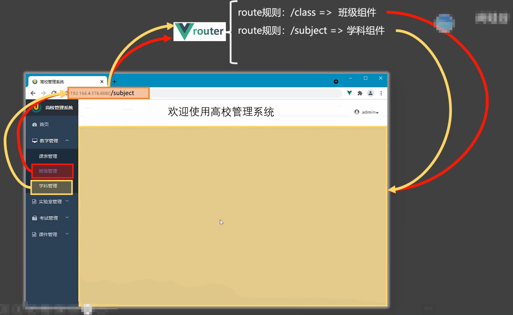

# 路由

客户端 **路由** 的作用是在 **单页应用 (SPA)** 中将浏览器的 **URL** 和用户看到的 **视图** 绑定起来

具体的来讲，客户端 **路由** 就是 **一个 `parttern(模式)` 和 一个 `view` 的绑定关系**。管理这些绑定关系的称为 **路由器**

**单页应用**：至始至终都只有一个 `.html` 页面。其他页面通过视图切换展示 

## 路由的工作流程

当点击导航区中的某一项时，会 **引起浏览器 URL 的变化**，这个变化会 **被 Vue Router 监测** 到，Router 就会进行路由匹配，路由匹配成功之后,首先 **卸载展示区中的页面**，然后 **重新挂载匹配成功的视图组件**



 
Vue 中视图之间的切换最主要的就是 **引起浏览器 URL 的变化**，只要 URL 发生变化，就会 **被 Vue Router 检测到**，从而 **触发视图的切换**


要在 Vue 中使用路由完成单页应用，就需要编写 **视图组件**，然后创建路由器(提供 **路由表**)，最后 **在主页面上展示**

+ 路由表: `(模式, 视图组件)` 形成键值对

## 注册异常组件的路由

我们已经完成 [异常视图组件](../views/README.md#异常视图) 的编写了。现在，将它们注册到路由表中

首先，创建路由器，并提供路由表，然后默认导出路由器。这部内容，在 `router/index.js` 中编写
```js
// 导入创建路由和路由历史记录模式函数
import { createRouter, createWebHistory } from 'vue-router'
import HomeView from '../views/HomeView.vue'

// 创还能一个 router
const router = createRouter({
  history: createWebHistory(import.meta.env.BASE_URL),
  routes: [
    {
      path: '/',
      name: 'home',
      component: HomeView
    },
    {
      path: '/error/403',
      name: 'PermissionDeny',
      // route level code-splitting
      // this generates a separate chunk (About.[hash].js) for this route
      // which is lazy-loaded when the route is visited.
      component: () => import('../views/errors/PermissionDeny.vue')
    },
    {
      path: "/:pathMatch(.*)*",  // 匹配所有前面没有命中的路由
      name: "NotFound",
      component: () => import('../views/errors/NotFound.vue'),
    }
  ]
})

// 将 router 暴露出去
export default router
```

> 稍后结束 **历史记录模式** 

然后，在 [`App.vue`](../App.vue) 中编写路由展示区域

```html
<script setup>
import {RouterView} from "vue-router"
</script>

<template>
<!-- 这是根页面：所有的页面都需要挂载在 App.vue 中才能呈现出来 -->
<!--  特别是 Vue Router 的子页面 -->
  <div>
    
  <!-- 路由出口：路由匹配到的组件将在这里渲染 -->
    <RouterView/>
  </div>
</template>

<style scoped></style>
```

### 历史记录模式


