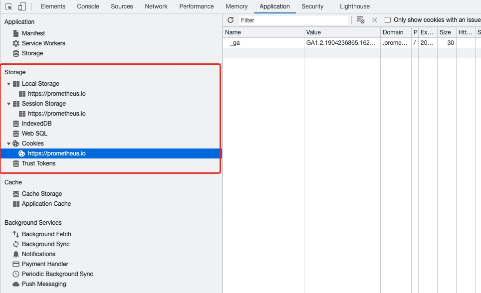
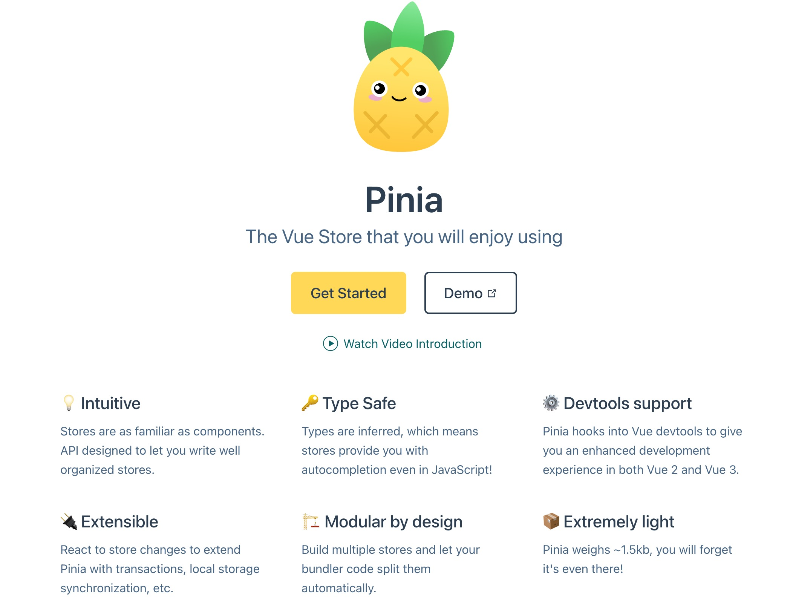

# Vue 状态管理

举个简单的例子, 我们每个页面在访问后端数据的时候 都需要 token, 那么所有组件都依赖 token 这个数据, 我们就需要找个地方存起来，让其他组件都能访问到它

通俗的讲，就是存储一些公用的东西，提供给各个组件使用，和服务器端的session功能也很类似

那我们如何来实现这个共享存储喃?

## 共享内存

第一种方式最直接: 共享内存, 直接开辟一个变量，全局都能访问到就可以了, 类似于后端的全局变量

前面我们在讲组建通信的时候就使用过:
+ 注入依赖
+ 组合式函数

### 全局注入

使用到 `provide()` 函数注入到根实例, 从而提供全局变量功能

```html
<script setup>
import { RouterLink, RouterView } from "vue-router";
import HelloWorld from "@/components/HelloWorld.vue";

import { ref, provide } from "vue";
// 如果的变量可以是响应式的
const count = ref(0);
provide(/* 注入名 */ "count", /* 值 */ count);
</script>
```

通过 `inject` 获取父组件注入的变量:

```html
<script setup>
import { inject } from "vue";

// 这里也可以获取默认值: inject(<变量名称>, <变量默认值>), 如果获取不到变量 就使用默认值
const count = inject("count");

const doClick = () => {
  count.value++;
};
</script>

<template>
  <button @click="doClick">You clicked me {{ count }} times.</button>
</template>
```

### 组合式函数

声明一个响应式模块，导出后，提供给所有组件使用

```js
// store/global.js
import { reactive } from "vue";

export const store = reactive({
  count: 0,
});
```

其他组件通过js的导入语法直接使用，妥妥的全局变量

```html
<script setup>
import { store } from "@/stores/global";

const doClick = () => {
  store.count++;
};
</script>

<template>
  <button @click="doClick">You clicked me {{ store.count }} times.</button>
</template>
```

### 总结

这种其实就是一个简单粗暴的 通过共享内存进行通信的方式, 好在其简单易懂，也许你会喜欢, 但是也有它的缺陷

因为这种方式使用的是内存, 所以页面关闭或者刷新就都没有, 想要就状态持久化 还需要存储

## 浏览器本地存储

这种方式就需要使用到 **浏览器的存储功能** 了, 它可供我们存储客户端临时信息 简称 Web Storage



> 浏览器提供三种存储
> + cookie：通常通过 后端设置
> + sessionStorage ：仅 **标签页** 可以访问，标签页关闭后存储内容被销毁
> + localStorage：**任何标签页** 都可以访问存储在 localStorage 中的内容，标签页关闭后，不会销毁内容

### cookie

cookie 是有可以 **设置过期时间** 的, **同一个域下的页面都可以访问**

**cookie在没有设置过期时间时，系统默认浏览器关闭时失效**，只有设置了没到期的保存日期时，浏览器才会把 cookie 作为文件保存在本地上。当 expire 到期时，cookie 不会自动删除，仅在下次启动浏览器或者刷新浏览器时，浏览器会检测 cookie 过期时间，如已过期浏览器则会删除过期 cookie

注意:

+ 数据存放大小: 4k, 因为每次http请求都会携带cookie
+ 浏览器关闭时， cookie会失效
+ 注意 cookie 可以支持 **httpOnly**, 这个时候 **前端 js 是修改不了的(也看不到)**

```js
// 读取cookie, 注意读取出来的cookie是个字符串
document.cookie
'language=zh; Sub-System=develop; sidebarStatus=1; Current-Namespace=c16mhsddrei91m4ri0jg; Refresh-Token=paBuyTIfsX3BeKrXrCmD8khUla6x8y1g'
// 需要自己处理
document.cookie.split('; ')

// 直接赋值就添加了一个key-value
document.cookie = 'cookieKey=cookieValue'
'language=zh; Sub-System=develop; sidebarStatus=1; Current-Namespace=c16mhsddrei91m4ri0jg; Refresh-Token=paBuyTIfsX3BeKrXrCmD8khUla6x8y1g; cookieKey=cookieValue'

// 当然cookie还有很多选项可以设置, 通过;隔开比如
document.cookie="username=John Doe; expires=Thu, 18 Dec 2043 12:00:00 GMT; path=/";

// 修改cookie和设置cookie一样, 保证key相同就可以
document.cookie = 'cookieKey=cookieValue2'
document.cookie
'language=zh; Sub-System=develop; sidebarStatus=1; Current-Namespace=c16mhsddrei91m4ri0jg; Refresh-Token=paBuyTIfsX3BeKrXrCmD8khUla6x8y1g; cookieKey=cookieValue2'

// 删除cookie时，把expires 设置到过期的时间即可, 比如设置个2019年的时间
document.cookie = `cookieKey=;expires=Mon, 26 Aug 2019 12:00:00 UTC`
document.cookie
'language=zh; Sub-System=develop; sidebarStatus=1; Current-Namespace=c16mhsddrei91m4ri0jg; Refresh-Token=paBuyTIfsX3BeKrXrCmD8khUla6x8y1g'
```

### sessionStorage

存储的数据只有 **在同一个会话中的页面才能访问并且当会话结束后数据也随之销毁**, 因此 `sessionStorage` 不是一种持久化的本地存储，仅仅是会话级别的存储

那么，到底什么是一个会话？多个标签页之间的数据是否会共享呢？我们可以验证下: 开启 2 个窗口, 直接通过浏览器修改 `sessionStorage` 进行验证

通过验证我们可以知道 **一个标签页就表示一个会话, 当标签页关闭, 回话就清除, 不通标签页之间不共享数据**

```js
// 通过setItem设置key-value
sessionStorage.setItem('key1', 'value1')
sessionStorage['key2']= 'value2'
sessionStorage.key2= 'value2'

// 查询sessionStorage对象
sessionStorage
// Storage {key2: 'value2', key1: 'value1', length: 2}

// 通过getItem获取key的值
sessionStorage.getItem('key1')
sessionStorage['key1']
sessionStorage.key1

// 修改
sessionStorage.key1 = 'value11'
sessionStorage['key1'] = 'value11'

// 删除key
sessionStorage.removeItem('key1')

// 清空storage
sessionStorage.clear()
```

### localStorage

`localStorage` 生命周期是 **永久**, 除非主动删除数据，否则数据是永远不会过期的

**相同浏览器的不同页面间可以共享相同的 `localStorage`（页面属于相同域名和端口）**

`localStorage` 的操作方法和 `sessionStorage` 完全一样:

```js
// 通过setItem设置key-value
localStorage.setItem('key1', 'value1')
localStorage['key2']= 'value2'
localStorage.key2 = 'value2'

// 查询sessionStorage对象
localStorage
// Storage {key2: 'value2', key1: 'value1', length: 2}

// 通过getItem获取key的值
localStorage.getItem('key1')
localStorage['key1']
localStorage.key1

// 修改
localStorage.key1 = 'value11'
localStorage['key1'] = 'value11'

// 删除key
localStorage.removeItem('key1')

// 清空storage
localStorage.clear()
```


## Vueuse与本地存储

作为 `vue3` 的标准库, `vueuse` 提供了很多实用的工具来实现了状态管理, 其他就有保护浏览器存储的组合式API函数:
[Vueuse](https://vueuse.nodejs.cn/guide/)

在 `vueuse` 中有一个高频使用的函数: `useStorage`, 就默认就是使用的 `LocalStorage`, 该函数已经将 `LocalStorage` 包装成了 **响应式** 了,
因此你可以把他理解为一个 **带有持久化机制的响应式对象**

> **useStorage** 默认使用 `localStorage` 包装而成的 `RefImpl` 对象

下面是 `useStorage` 的基础用法:

```js
import { useStorage } from '@vueuse/core'

// bind object
const state = useStorage('my-store', { hello: 'hi', greeting: 'Hello' })

// bind boolean
const flag = useStorage('my-flag', true) // returns Ref<boolean>

// bind number
const count = useStorage('my-count', 0) // returns Ref<number>

// bind string with SessionStorage
const id = useStorage('my-id', 'some-string-id', sessionStorage) // returns Ref<string>

// delete data from storage
state.value = null
```

我们结合前面讲到共享内存的通信方式, 把他们改造成, 结合本地存储基础, 从而避免刷新页面是状态丢失:
+ 注入依赖
+ 组合式函数

### 注入依赖持久化

直接使用 `useStorage` 构造一个响应式持久化变量:

```html
<script setup>
import { RouterLink, RouterView } from "vue-router";
import { useStorage } from '@vueuse/core'
import HelloWorld from "@/components/HelloWorld.vue";

import { provide } from "vue";
// 如果的变量可以是响应式的
const count = useStorage('count', 0);
provide(/* 注入名 */ "count", /* 值 */ count);

// 这里也可以获取默认值: inject(<变量名称>, <变量默认值>), 如果获取不到变量 就使用默认值
// const count = inject("count");
</script>
```

### 全局变量持久化

声明一个响应式模块，导出后，提供给所有组件使用

```js
// store/global.js
import { useStorage } from '@vueuse/core'

export const store = useStorage('count', 0);

// 通过 store.value 可以访问到该全局变量
```

## pinia

虽然我们的手动状态管理解决方案在简单的场景中已经足够了，但是在大规模的生产应用中还有很多其他事项需要考虑：

+ 更强的团队协作约定
+ 与 Vue DevTools 集成，包括时间轴、组件内部审查和时间旅行调试
+ 模块热更新 (HMR)
+ 服务端渲染支持

Pinia 就是一个实现了上述需求的状态管理库，由 Vue 核心团队维护，对 Vue 2 和 Vue 3 都可用




### vuex 与 pinia

Pinia 最初正是为了探索 Vuex 的下一个版本而开发的，
因此整合了核心团队关于 Vuex 5 的许多想法。最终，我们意识到 Pinia 已经实现了我们想要在 Vuex 5 中提供的大部分内容，因此决定将其作为新的官方推荐

相比于 Vuex，Pinia 提供了更简洁直接的 API，并提供了* *组合式风格的 API**，最重要的是，在使用 TypeScript 时它提供了更完善的类型推导

下面是使用组合式 API 定义的一个 `store`

```js
import { defineStore } from 'pinia'


//你可以将 'defineStore()' 的返回值命名为任何你想要的，但最好使用 store 的名称并在其周围加上 'use' 和'store'(例如:' userstore '， ' useCartStore '， 'useProductStore')
// 第一个参数是整个应用程序中存储的唯一id
export const useStore = defineStore('main', {
  // other options...
})
```

### 基本概念

pinia遵循“单向数据流”这一概念, 流程如下:


+ 状态：**驱动整个应用的数据源**；
+ 视图：对状态的一种 **声明式映射**, **视图层获取状态**；
+ 交互：状态根据用户在视图中的输入而作出相应变更的可能方式, 通过 actions 来修改状态。

通过defineStore来声明一个状态管理模块, 从中也可以看出这 $3$ 个核心概念:

```js
export const useCounterStore = defineStore('counter', {
  // 状态数据
  state: () => ({ count: 0, name: 'Eduardo' }),
  // 获取状态数据
  getters: {
    doubleCount: (state) => state.count * 2,
  },
  // 修改状态的数据
  actions: {
    increment() {
      this.count++
    },
  },
})
```


### 安装

当然你也可以选择手动安装:

```sh
yarn add pinia
# or with npm
npm install pinia
```

然后在项目中引入

```js
import { createApp } from 'vue'
import { createPinia } from 'pinia'
import App from './App.vue'

const pinia = createPinia()
const app = createApp(App)

app.use(pinia)
app.mount('#app')
```

当然更加简单的方法是 使用 cli安装, 还能给我们生成实例

```sh
vue add pinia
```

### 定义Store

选项式风格:

```js
export const useCounterStore = defineStore('counter', {
  state: () => ({ count: 0, name: 'Eduardo' }),
  getters: {
    doubleCount: (state) => state.count * 2,
  },
  actions: {
    increment() {
      this.count++
    },
  },
})
```

pinia 很友好为我们提供了 Setup 风格, 这样整体代码可以保证统一的风格:

```js
export const useCounterStore = defineStore('counter', () => {
  const count = ref(0)
  const name = ref('Eduardo')
  const doubleCount = computed(() => count.value * 2)
  function increment() {
    count.value++
  }

  return { count, name, doubleCount, increment }
})
```

In Setup Stores:
+ `ref()s` become state properties
+ `computed()s` become getters
+ `function()s` become actions


### 使用 Store

通过组合式函数方式直接使用

```js
import { useCounterStore } from '@/stores/counter'

export default {
  setup() {
    const store = useCounterStore()

    return {
      // you can return the whole store instance to use it in the template
      store,
    }
  },
}
```

> 测试下 看看 devtools 中 vuex是否正常, 看看刷新后如何

### 持久化存储

上面的测试应该已经知道 pinia 的状态存储并不能持久化，存储在 Vuex 中的 store 里的数据，只要一刷新页面，数据就丢失了

那我们能不能叫 pinia 的存储修改为 localstorage 呢? 答案是可以的, 有个插件就完成了这个事儿: `pinia-plugin-persist`,具体使用说明请参考: [Pinia Plugin Persist](https://seb-l.github.io/pinia-plugin-persist/basic-usage.html)

#### 安装插件

```shell
npm i pinia-plugin-persist --save
```

安装好了后我们配置 `vuex` 使用该插件： `store/index.js`

```js
// 1. 引入依赖
import piniaPersist from 'pinia-plugin-persist'

// 2.配置store实例使用piniaPersist插件
const pinia = createPinia()
pinia.use(piniaPersist)
```

这样我们持久化的插件就安装上了, 但是默认我们的 state 并没有持久化, 可以测试下

#### 使用插件

要开启 `state` 的持久化，在定义 `store` 的时候，传递一个参数:

```js
import { defineStore } from 'pinia'

export const useUserStore = defineStore('storeUser', {
  state: () => {
    return {
      firstName: 'S',
      lastName: 'L',
      accessToken: 'xxxxxxxxxxxxx'
    }
  },
  actions: {
    setToken (value: string) {
      this.accessToken = value
    }
  },
  persist: {
    enabled: true , // 这个配置代表存储生效，而且是整个store都存储
  }
})
```

注意插件默认使用的是: `sessionStorage`, 当然我们也可以自定义存储策略

#### 存储策略

```js
// store/use-user-store.ts
export const useUserStore = defineStore('storeUser', {
  state () {
    return {
      firstName: 'S',
      lastName: 'L',
      accessToken: 'xxxxxxxxxxxxx',
    }
  },
  persist: {
    enabled: true,
    strategies: [
      { storage: sessionStorage, paths: ['firstName', 'lastName'] }, // firstName 和 lastName字段用sessionStorage存储
      { storage: localStorage, paths: ['accessToken'] }, // accessToken字段用 localstorage存储
    ],
  },})
```

## 参考

+ [Pinia Plugin Persist](https://seb-l.github.io/pinia-plugin-persist/basic-usage.html)
+ [cookies、sessionStorage和localStorage解释及区别](https://www.cnblogs.com/pengc/p/8714475.html)
+ [JavaScript Cookie](https://www.runoob.com/js/js-cookies.html)
+ [JavaScript创建、读取和删除cookie](https://www.jb51.net/article/169117.htm)
